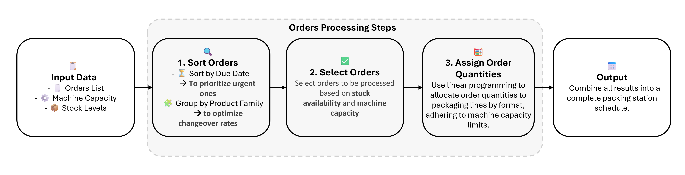

#  Production Planning Automation using Excel VBA & Linear Programming

This project is my **first experience in automation**, designed to be simple yet impactful, it aims to improve production planning in the **agri-food industry** using **Excel VBA and Solver** — making it a great starting point for beginners interested in optimization and industrial automation.

---

##  Project Overview

###  Problem Statement

During my observations in the field, I noticed that **manual g planning** was time-consuming and complex. **Adjusting to last-minute demand changes** while respecting operational constraints was particularly **challenging**.
**
It became essential to:
- Develop a structured logic for efficient planning
- Reduce the number of **series changeovers** (which cause downtime)
- **Automate** the planning process while respecting all operational and client-specific constraints

>  **Key Question:**  
> *How can we automate the planning process while satisfying all constraints and improving performance indicators like service and changeover rates?*

---

##  Solution Overview

###  Problem & Constraints

The challenge involves balancing multiple constraints:
- **Multiple packaging formats** (e.g., 4)
- **Several production lines**:
  - Each line handles specific formats only
  - Line capacities vary by format
- **Product families** (e.g., 4), each with different quality requirements
- **Customer constraints** and **stock availability**

###  KPIs to Optimize
- **Service Rate** → Maximize on-time deliveries
- **Changeover Rate** → Minimize changes between product families

###  Step-by-Step Resolution

#### 1️. Organize Input Data in Excel
Input data (orders, lines, capacities, formats, etc.) is structured in a specific area for easy access by the VBA program.

#### 2️. Define the Planning Logic
The logic is illustrated in the scheme below:

To implement the final step of assigning orders while optimizing resource usage, a linear programming model was used:

- Let orders be: `C1, C2, ..., Cm`  
- Let lines be: `L1, L2, ..., Ln`

**Variables:**
- `xᵢⱼ`: Number of pallets from order `Ci` assigned to line `Lj`  
- `Dᵢ`: Demand of order `Ci`  
- `Kⱼ`: Capacity of line `Lj`

**Objective Function:**
Maximize orders processed $$\left( \sum_{ij} x_{ij} \right)$$

**Constraints:**
- Line capacity : $$\sum_{i=1}^m x_{ij} $$
- Order demand : $$\sum_{j=1}^n x_{ij} $$
- Non-negativity : $$\ x_{ij} \geq \ 0 $$

#### 3️. Automate the Planning with Excel VBA + Solver
The planning logic is implemented using Excel VBA and Solver. The application automatically generates an optimized plan in under 5 minutes.

---

##  Results

-  **90% reduction** in manual planning time  
-  **20% improvement** in changeover rate  
-  **100% service rate** achieved (on-time delivery)

---

##  Key Features

-  **Fully Automated**: Generates optimal plans in minutes  
-  **Changeover Optimization**: Batches similar orders to reduce switchovers  
-  **Beginner-Friendly Interface**: Excel buttons & color-coded cells  
-  **Scalable**: Adaptable to other production lines or sectors

---

##  Technologies & Tools Used

- **Excel VBA** – For automation and UI  
- **Excel Solver** – For solving linear optimization problems  
- **Lean Manufacturing Techniques (SMED)** – To reduce waste and changeover time

---

